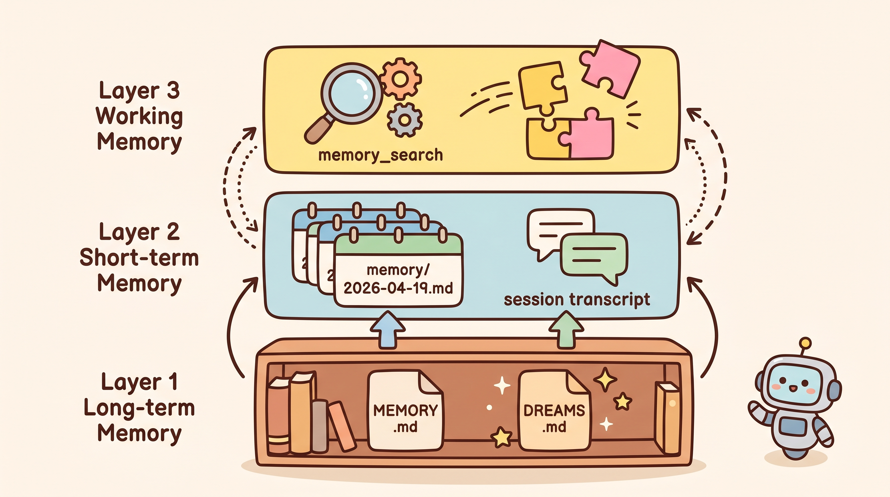

# 【第一篇】AI Agent 记忆体系全景：从上下文到长期记忆的技术演进

> 本文约 2200 字，探讨 AI Agent 记忆体系的设计哲学与架构演进

---

## 一、为什么 AI Agent 需要「记忆」？

大语言模型本质上是**无状态的**（stateless）——每次对话，模型只看得见当前 context window 里的内容。一旦 session 结束，记忆清零。这对于真正的个人助手来说是致命问题：谁愿意每次都重新解释一遍"我是谁、我关心什么、这件事很重要别忘了"？

把对话历史全部塞进 context 是一种解法，但有三个绕不过去的坑：

1. **context window 有上限**——再贵的模型也有最大 token 数
2. **成本线性增长**——塞得越多，费用越高，延迟越大
3. **信号稀释**——无关的旧对话会冲淡真正重要的上下文

所以 AI Agent 的记忆体系要回答的真正问题是：**如何在有限 context 中，让模型随时能拿到对它有帮助的高价值信息？**

---

## 二、记忆体系的三层架构

目前主流 AI Agent 的记忆体系大多采用三层架构：

```
┌─────────────────────────────────────────────────────┐
│           L1: 长期记忆 (Long-Term Memory)             │
│   • 持久化到磁盘的文件或数据库                       │
│   • 跨 session 保持                                  │
│   • 高价值、经过提炼的知识和偏好                     │
├─────────────────────────────────────────────────────┤
│           L2: 短期记忆 (Short-Term Memory)           │
│   • 当前 session 的上下文                           │
│   • 最近的对话历史、工作成果                         │
│   • 随 session 结束而清除                           │
├─────────────────────────────────────────────────────┤
│           L3: 工作记忆 (Working Memory)               │
│   • 模型在单个 turn 内实际看到的 context             │
│   • 由 L1 + L2 检索结果拼装而成                     │
│   • 每个对话轮次动态变化                             │
└─────────────────────────────────────────────────────┘
```



OpenClaw 是这套三层模型的典型实现：

- **L1 长期记忆**：`MEMORY.md`（手工 + 梦境系统自动写入）+ `DREAMS.md`
- **L2 短期记忆**：`memory/YYYY-MM-DD.md`（每日笔记）+ session transcript
- **L3 工作记忆**：每次 agent turn 时由 `memory_search` 检索拼装的 context

---

## 三、OpenClaw 的记忆体系实现

### 3.1 核心文件结构

```
~/.openclaw/workspace/
├── MEMORY.md              # 长期记忆
├── DREAMS.md              # 梦境日记（可选）
└── memory/
    ├── YYYY-MM-DD.md      # 每日笔记
    ├── .dreams/           # 梦境系统内部状态
    └── dreaming/           # 梦境阶段输出
```

**MEMORY.md** 是整个系统的锚点。每次 DM session 启动，模型都会加载这个文件。它是"模型真正记住的东西"——不是 hidden state，而是显式写入的文本，用户可以直接打开文件查看、编辑、删除。

**memory/YYYY-MM-DD.md** 是每日运行日志，记录当天发生的重要事件，由模型在记忆 flush 或每日结束时自动生成：

```markdown
# 2026-04-19 日记

## 上午
- 配置了 openclaw-weixin，重新绑定微信账号
- 运行了三个 cron 任务排查：港股盯盘、美股日报、AI简报
- 发现 timeout 设置过短导致任务频繁失败，调整为 300s

## 下午
- 用户询问 OpenClaw 和 Hermes 记忆体系
...
```

### 3.2 记忆搜索：混合检索

`memory_search` 工具实现了**混合搜索**，结合两种检索方式：

```python
# 混合搜索的简化逻辑
def hybrid_search(query, top_k=10):
    # 1. 语义向量检索（semantic similarity）
    vector_results = vector_store.search(query, top_k=20)
    
    # 2. 关键词 BM25 检索（exact match）
    keyword_results = keyword_index.search(query, top_k=20)
    
    # 3. Reciprocal Rank Fusion 合并排序
    fused = reciprocal_rank_fusion(
        [vector_results, keyword_results], 
        k=60
    )
    
    return fused[:top_k]
```

向量检索能找意思相近但不包含原词的记忆（比如搜"我的网站"能找到 FantasyAILab-website 的笔记），关键词检索确保专有名词、ID、代码符号不会漏掉。两者各有所长，RRF 把它们的结果合并，不用调参。

OpenClaw 会自动检测可用的 embedding provider（OpenAI、Gemini、Voyage、Mistral），配置好 API key 就能直接开启。

### 3.3 自动记忆 Flush

Compaction（压缩）发生之前，OpenClaw 会自动运行一次"静默 turn"，提醒模型将重要上下文写入 memory 文件：

```json
{
  "plugins": {
    "entries": {
      "memory-core": {
        "config": {
          "memoryFlush": {
            "enabled": true,
            "beforeCompaction": true
          }
        }
      }
    }
  }
}
```

这就是把记忆写入从"靠模型自觉"变成"系统级保证"——即便模型某次忘了写，compaction 前的 flush 也会兜底。

---

## 四、上下文窗口管理：Compaction 与 Pruning

当对话接近 context window 上限，OpenClaw 用两种机制管理：

| 机制 | 作用 | 是否持久化 |
|------|------|-----------|
| **Compaction** | 将早期对话压缩为摘要 | 是（保存在 transcript） |
| **Pruning** | 裁剪旧的 tool result | 否（仅本次请求内） |

Compaction 的流程：

```
1. 检测到 context 接近上限
2. compaction 前触发 memory flush
3. 将早期对话发给模型生成摘要
4. 摘要替换原始对话历史写入 transcript
5. 用压缩后的 context 继续当前请求
```

可以用不同模型做压缩摘要，这对使用本地小模型的场景很有用：

```json
{
  "agents": {
    "defaults": {
      "compaction": {
        "model": "openrouter/anthropic/claude-sonnet-4-6"
      }
    }
  }
}
```

---

## 五、与 Hermes 的对照

**Hermes Agent** 是 GitHub 上另一个活跃的 AI Agent 框架，记忆系统走了不同路线：

| 维度 | OpenClaw | Hermes Agent |
|------|----------|--------------|
| 存储介质 | Markdown 文件（磁盘） | JSON + 向量数据库 |
| 记忆写入 | 模型自动 + 梦境系统 | 规则触发 + API 显式调用 |
| 检索方式 | 混合搜索（向量+关键词） | 语义向量检索为主 |
| 记忆分层 | 三层（长/短/工作） | 两层（持久/会话） |

Hermes 偏向规则驱动——开发者显式定义何时写入记忆；OpenClaw 偏向模型驱动——让模型自己判断什么值得记住。前者更精确但需要更多开发工作，后者更省心但存在随机性。

---

## 六、本篇小结

AI Agent 的记忆体系，要解决的是"记什么、怎么存、怎么取"三个问题。

OpenClaw 的答案：
- **文件即记忆**：所有记忆都是可读写的 Markdown，模型没有 hidden state
- **混合检索**：向量相似度 + 关键词精确匹配，不同任务用不同方式
- **系统级保障**：compaction 前的自动 flush 确保重要信息不丢失

---

*【预告：第二篇将深入解析 OpenClaw 的梦境系统——Light/Deep/REM 三阶段协作的记忆晋升机制，以及 six-signal 评分体系如何决定哪些记忆值得晋升为长期记忆。】*
