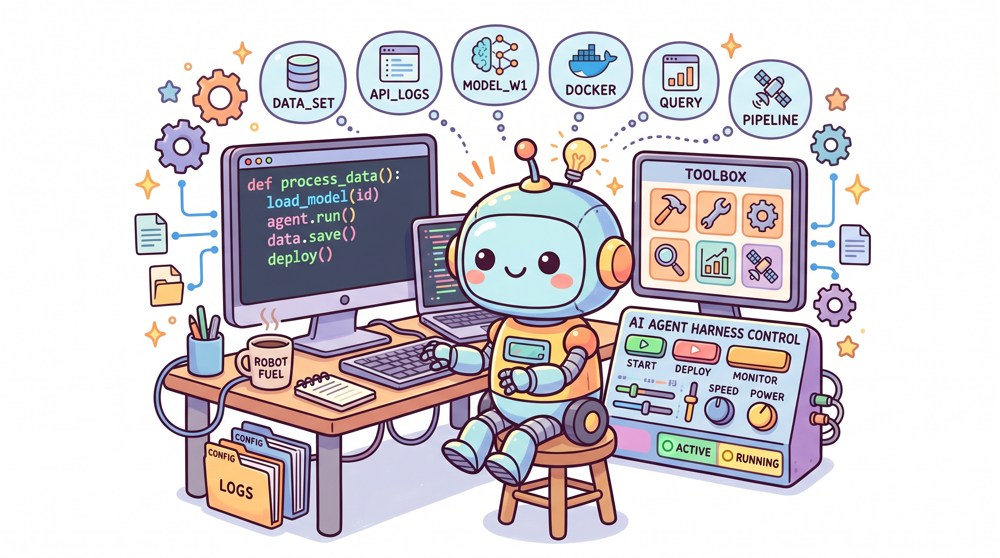

# Harness 工程实战（一）：为什么模型不是壁垒，基础设施才是

---

2025 年底，LangChain 团队做了一次实验：只换底层基础设施，模型和权重完全不动，TerminalBench 2.0 排名从 30 名开外跃升到第 5 名。

这个结果让很多人重新思考了一个问题：做 AI 应用，到底什么才是真正的壁垒？

## 被混淆的真相

很多人以为 AI 应用的天花板是模型。GPT-4 比 Claude 强，Claude 又比大多数开源模型强，所以要等更好的模型。

实际情况是，同一个模型，给它不同的 Harness，表现可以天差地别。

那个实验换的不是模型，是模型周围的软件基础设施。编排循环怎么写、上下文怎么管理、工具怎么定义、状态怎么持久化——这些不一样，模型跑出来的效果就不一样。

另一个更极端的研究：让 LLM 自己来优化这套基础设施，优化出来的系统通过率达到了 76.4%，超过了人工设计的系统。模型还是那个模型。基础设施变了，一切都变了。

## 冯·诺依曼架构的回归

Beren Millidge 在 2023 年给了一个精确的类比：

原始 LLM 像一台没有内存、没有硬盘、没有 I/O 的 CPU。

上下文窗口是 RAM——读写速度快，但容量有限。外部数据库是硬盘——容量大，但读写速度慢。工具集成相当于设备驱动。Harness，就是操作系统。

原始 LLM 什么都做不了，必须有基础设施来管理它的输入、输出、内存和持久化状态。LLM 也是。

## 三个工程层次的递进

Harness 工程不是凭空出现的，它是从两个更早的工程层次演化而来的。

**第一层：提示词工程。** 怎么写好指令，怎么设计 few-shot examples。这在 2022-2023 年是主流。

**第二层：上下文工程。** 发现提示词写得好不够，还得管理模型看到什么、在什么时候看到。RAG、上下文压缩、记忆系统，都在这个层次。

**第三层：Harness 工程。** 前两层都是局部优化。真正的 Harness 工程涵盖这两者，加上完整的应用基础设施：工具编排、状态持久化、错误恢复、验证循环、安全执行和生命周期管理。

Vivek Trivedi 的公式很精准："如果你不是模型，你就是 Harness。"

## Agent 和 Harness 的区别

当有人说"我做了个 Agent"，实际意思是他做了个 Harness，然后把它指向了一个模型。

Agent 是涌现出来的行为：那个有目标、会用工具、能自我纠错的实体。Harness 是产生这种行为的机械装置。

就像飞机飞行是行为，空气动力学是 Harness。你看不到空气动力学，但看到的是飞机。

Claude Code 文档直接说 SDK 就是"驱动 Claude Code 的 Agent Harness"。OpenAI 的 Codex 团队也用同样的表述。

## TerminalBench 证明了什么

排名能移动 20 多个位置，靠的不是换模型，是换 Harness。

这意味着 AI 应用的核心竞争力不在模型本身。模型会越来越好，越来越开放，越来越便宜。真正的壁垒是 Harness 的设计能力。

就像 1990 年代的软件公司，核心竞争力不是懂 DOS 命令，而是知道怎么用 DOS 做出对用户有价值的东西。

## 你的 AI 应用为什么失败

某人搭了一个聊天机器人，接入了工具，做出了能演示的原型。但推向生产环境时，模型会忘记三步之前做过什么，工具调用会失败，上下文窗口塞满了无用信息。

然后他开始抱怨模型不够强。

问题不在模型，在模型周围的一切。下次 Agent 失败时，别怪模型，看看 Harness。
