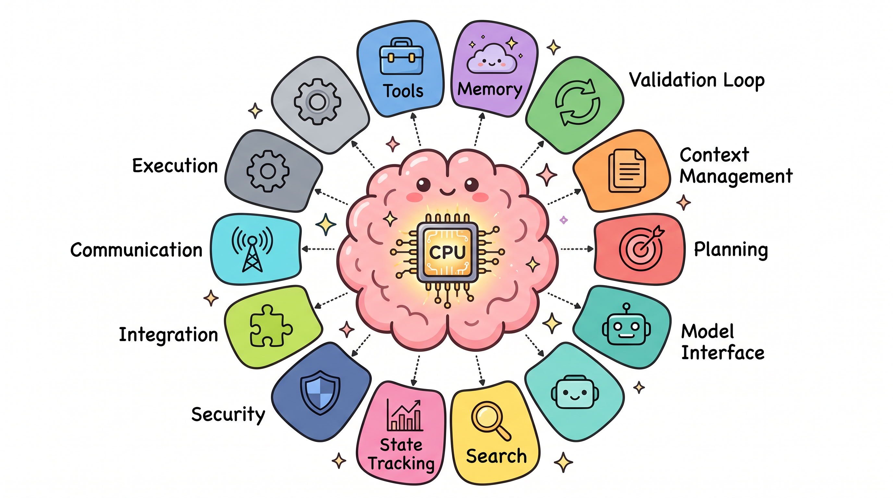

# Harness 工程实战（二）：生产级 Harness 的十二个组件

---

搭一个能跑起来的 Agent 原型不难。接个 API，写个循环，定义两个工具，差不多就能演示了。

但要从演示走到生产，复杂度会突然跳升。模型会失败，上下文会爆炸，状态会丢失，错误会复合。这些问题每个都能让你的系统在关键时刻瘫痪。

这不是模型的问题，这是基础设施的问题。

综合 Anthropic、OpenAI、LangChain 和更广泛的实践者社区的经验，一个生产级 Agent Harness 有十二个独立组件。



## 1. 编排循环（Orchestration Loop）

这是心脏。

它实现思考-行动-观察循环，也叫 ReAct 循环。循环运行：组装提示词，调用 LLM，解析输出，执行工具调用，反馈结果，重复直到完成。

Anthropic 把他们的运行时描述为"哑循环"——所有智能都在模型里，Harness 只管理回合。模型才是推理的地方，Harness 不要自作聪明。

一个典型的实现：

```python
while agent.continuing:
    messages = agent.build_messages()
    response = model(messages)
    agent.handle_response(response)
```

## 2. 工具（Tools）

工具是 Agent 的手。它们被定义为模式：名称、描述、参数类型。注入到 LLM 的上下文中，让模型知道有什么可用。

Claude Code 提供六类工具：文件操作、搜索、执行、网络访问、代码智能和子智能体生成。

工具层处理：注册、模式验证、参数提取、沙盒执行、结果捕获，以及把结果格式化回 LLM 可读的观察。

```python
# OpenAI Agents SDK 的函数工具定义
@function_tool
def get_weather(city: str) -> str:
    """Get current weather for a city."""
    return f"Weather in {city}: 22°C, sunny"
```

## 3. 记忆（Memory）

短期记忆是单个会话内的对话历史。长期记忆跨会话持久化。

Claude Code 实现了三层层次结构：
- 轻量级索引（每条约 150 字符，始终加载）
- 按需拉取的详细文件
- 仅通过搜索访问的原始记录

一个关键设计原则：Agent 把自己的记忆当作"提示"，在行动前会对照实际状态验证。记忆可能过时，必须校验。

## 4. 上下文管理（Context Management）

这是许多 Agent 失败的地方。

核心问题是上下文腐烂：当关键内容落在窗口中间位置时，模型性能下降 30% 以上。Chroma 的研究和斯坦福的"Lost in the Middle"都证实了这一点。

即使是百万 token 窗口，随着上下文增长，指令遵循能力也会退化。

Claude Code 使用 grep、glob、head、tail 而不是加载完整文件。这看起来是微优化，但在处理大型代码库时，这决定了上下文窗口的消耗速度。

## 5. 提示词构建（Prompt Construction）

这是组装模型在每一步实际看到的内容。

OpenAI 的 Codex 使用严格的优先级栈：
1. 服务器控制的系统消息（最高优先级）
2. 工具定义
3. 开发者指令
4. 用户指令（级联 AGENTS.md 文件，32 KB 限制）
5. 对话历史

## 6. 输出解析（Output Parsing）

现代 Harness 依赖原生工具调用，模型返回结构化的 `tool_calls` 对象，而不是必须解析的自由文本。

```python
response = model(messages)
if response.tool_calls:
    for tool_call in response.tool_calls:
        result = execute_tool(tool_call)
        messages.append({"role": "tool", "content": result})
    # 继续循环
else:
    return response.content  # 最终答案
```

## 7. 状态管理（State Management）

LangGraph 将状态建模为流经图节点的类型化字典，用 reducer 合并更新。检查点发生在超级步骤边界，支持中断后恢复和时间旅行调试。

Claude Code 采用不同方法：用 git 提交作为检查点，进度文件作为结构化草稿本。

## 8. 错误处理（Error Handling）

一个 10 步流程，每步 99% 成功率，端到端成功率仍然只有约 90.4%。错误会快速复合。

LangGraph 区分四种错误类型：
- **瞬态**：带退避重试
- **LLM 可恢复**：将错误作为 ToolMessage 返回，让模型调整
- **用户可修复**：中断等待人工输入
- **意外**：冒泡用于调试

Stripe 的生产 Harness 将重试尝试上限设为两次。超过两次还失败，说明问题不在重试能解决的范围内。

## 9. 防护栏和安全（Guardrails and Safety）

OpenAI 的 SDK 实现三个级别：
- 输入防护栏（在第一个 Agent 上运行）
- 输出防护栏（在最终输出上运行）
- 工具防护栏（在每次工具调用时运行）

Claude Code 独立管理约 40 个离散工具能力，分三个阶段：项目加载时建立信任、每次工具调用前权限检查、高风险操作的明确用户确认。

## 10. 验证循环（Verification Loops）

这是区分玩具演示和生产 Agent 的关键。

Anthropic 推荐三种方法：
- **基于规则的反馈**：测试、linter、类型检查器
- **视觉反馈**：通过 Playwright 截图用于 UI 任务
- **LLM 作为评判者**：单独的子智能体评估输出

Boris Cherny（Claude Code 的创建者）指出：给模型一种验证其工作的方法，质量提高 2 到 3 倍。

## 11. 子智能体编排（Subagent Orchestration）

Claude Code 支持三种执行模型：
- **Fork**：父上下文的字节相同副本
- **Teammate**：带有基于文件的邮箱通信的单独终端窗格
- **Worktree**：自己的 git 工作树，每个 Agent 一个独立分支

## 12. 工具注册（Tool Registry）

这是让前面所有组件协同工作的基础设施。

一个关键原则：暴露当前步骤所需的最小工具集。Vercel 从 v0 中删除了 80% 的工具，获得了更好的结果。

## 这十二个组件不是孤立的

这十二个组件是一个协同系统。任何一个环节出问题，整个系统都会受影响。编排循环驱动一切。工具被注册后由编排循环调用。记忆影响提示词构建的内容。上下文管理决定什么时候需要压缩历史。错误处理捕获工具执行中的失败。验证循环检查工具输出的质量。

这也是为什么 Harness 工程不是简单的技术堆砌，而是系统设计。
