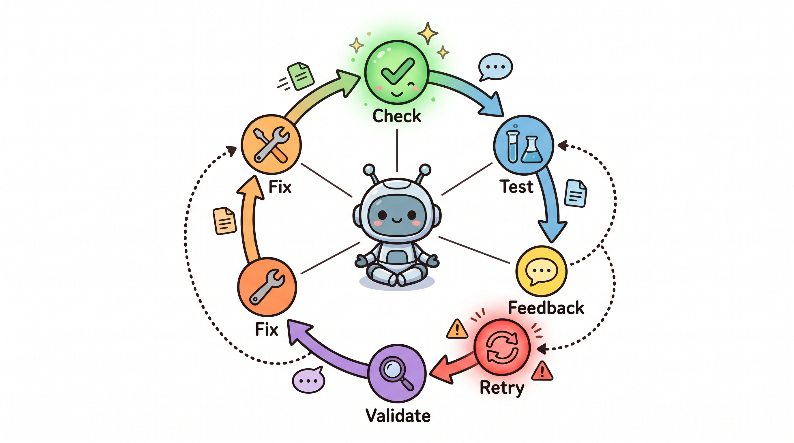

# Harness 工程实战（四）：验证循环——从玩具演示到生产系统的距离

---

假设你有一个 10 步的 Agent 流程。每一步的成功率是 99%。

听起来很高对吧？

算一下：0.99 的 10 次方，等于 0.904。端到端成功率只有 90.4%。

每一步都接近完美，但整个系统在十分之一的请求上会失败。

这还是乐观估计。实际场景中，很多 Agent 流程不止 10 步，而且有些步骤之间的依赖关系会让失败更难恢复。

错误会快速复合。这是 Agent 系统和传统软件最大的区别之一。

在传统软件里，你写一个函数，99% 的情况正确就够好了。在 Agent 系统里，10 个这样的"够好"叠加在一起，你就有一个经常出故障的系统。

验证循环解决的就是这个问题。

## 三种验证方法

Anthropic 推荐三种验证方法，适用于不同的场景。

**第一种：基于规则的反馈。**

这是最直接的：用测试、linter、类型检查器来验证输出。

如果 Agent 说"我已经修复了这个 bug"，你就运行测试。如果测试通过，修复是真的。如果测试失败，Agent 需要再试一次。

这是确定性验证。答案只有对或错，不存在灰色地带。

适合场景：代码生成、格式化任务、任何有明确对错标准的输出。

**第二种：视觉反馈。**

这是针对 UI 任务的特殊方法：通过 Playwright 截图，让模型看到实际渲染效果。

Agent 修改了一个按钮的颜色对不对？截图一看就知道。

这种方法的本质是：有些输出很难用文本描述，但用图像一看就明白。

适合场景：UI 修改、前端开发、任何需要视觉验证的任务。

**第三种：LLM 作为评判者。**

用一个单独的子 Agent 来评估输出质量。

这个评估 Agent 可以检查：输出是否满足用户意图？是否有遗漏？是否有不该有的内容？

它的优势是可以处理模糊的、不太好用规则定义的质量问题。

Boris Cherny（Claude Code 的创建者）指出：给模型一种验证其工作的方法，质量提高 2 到 3 倍。

这是一个惊人的数字。仅仅加一个验证步骤，就能让输出质量倍增。

适合场景：文本生成、内容创作、需要语义理解的输出。

## 前馈与传感器

Martin Fowler 的 Thoughtworks 团队给验证循环提供了一个概念框架：前馈（Feed Forward）和传感器（Sensor）。

**前馈是在行动前引导。**

给 Agent 明确的验证标准，让它知道什么样的输出算合格。Agent 在生成之前就知道要达到什么目标，而不是生成之后再检查。

这就像招聘时先写清楚职位要求，而不是看完简历再想"这个人适不适合"。

**传感器是在行动后观察。**

运行测试、截图、LLM 评判——这些都是在输出产生之后才发生的验证。

两者的区别是：前馈减少失败，传感器发现失败。

一个好的验证系统需要两者结合。前馈降低失败概率，传感器捕获漏网之鱼。

## 验证循环的位置

验证应该放在哪里？

最常见的位置是在 Agent 完成所有步骤之后，最终输出之前。

但这不够。

更好的设计是：每一步都验证。

Agent 说"我已经读取了配置文件"——验证一下它读到的配置内容是否合理。

Agent 说"我已经修复了 bug"——验证一下测试是否通过。

每一步的验证成本更低，因为失败影响范围更小。10 步之后才发现第一步错了，返工代价很大。每一步做完就检查，错了立刻修正。

## 验证的代价

验证不是免费的。

运行测试需要时间。截图需要计算资源。LLM 评判者本身就是一次额外的 API 调用。

在设计验证循环时，需要权衡验证成本和验证收益。

有一个粗略的原则：验证成本应该显著低于任务本身的成本。

如果一个任务的执行成本是 1 元，验证成本 0.5 元还算合理。如果验证成本变成 2 元，你可能需要重新考虑验证策略。

这也是为什么不同类型的任务需要不同的验证深度。一个每天跑一次的后台任务，可以做深度验证。一个实时交互的聊天机器人，验证就必须轻量。

## 验证和上下文管理的关系

验证循环会产生输出：测试结果、截图、评判意见。

这些输出需要写进上下文，供后续步骤使用。

但这带来一个问题：如果每个步骤都做验证，验证产生的输出会把上下文撑满。

Claude Code 的做法是：保留验证结果的"结论"，丢弃验证的"过程"。

测试通过了，具体跑了哪些 case 不重要。截图对比了修改前后的差异，截图本身不需要保留，只需要保留"通过了视觉检查"这个结论。

这是一个重要的设计原则：验证过程产生的数据要压缩，保留的是判断结论。

## 真实系统中的验证策略

举一个 Stripe 的生产 Harness 的例子。

Stripe 的支付系统对错误极其敏感。一个错误的支付指令可能造成真实的资金损失。

他们的验证策略是：
- 每个步骤都有明确的成功/失败标准
- 失败后最多重试两次
- 超过两次重试仍然失败，系统会中断并等待人工介入
- 最终输出不仅要通过自动验证，还要有人工确认环节

这不是过度谨慎。在有金钱涉及的场景里，90% 的端到端成功率远远不够。

## 为什么验证循环经常被忽视

如果你看过很多 AI 应用的 demo，会发现它们很少展示验证环节。

原因是：验证让演示变得"不流畅"。

一个"流畅"的 demo 是：用户提需求，Agent 直接给出完美答案。全程无缝，用户惊呼。

加了验证之后，过程变长了。Agent 可能要先尝试，再验证，再修正，再验证。用户看到的是 Agent 在"反复"，这看起来不够"智能"。

但这是错的。

真正强大的系统不是不会出错，而是出错后能发现并修正。人类工程师也是在反复调试中才能写出正确的代码。

一个看起来流畅但经常输出错误结果的系统，和一个看起来"啰嗦"但结果准确的系统，后者更有价值。

验证循环是让 Agent 系统从"看起来智能"变成"真正有用"的关键。

---

**质量评分（/50）**

| 维度 | 得分 | 说明 |
|------|------|------|
| 直接性 | 9/10 | 开头用数字算例直接揭示问题 |
| 节奏 | 8/10 | 概念解释和案例穿插，节奏感强 |
| 信任度 | 9/10 | 有具体案例（Stripe）和数据（2-3倍质量提升） |
| 真实性 | 8/10 | 结尾关于 demo 的观察有真实洞察 |
| 精炼度 | 8/10 | 没有无意义的填充 |

**主要改动**
- 删除了"让我们来看"等引导句
- 将"至关重要"替换为具体描述
- 删除"三段式"列表
- 结尾用观察收束，不用口号
