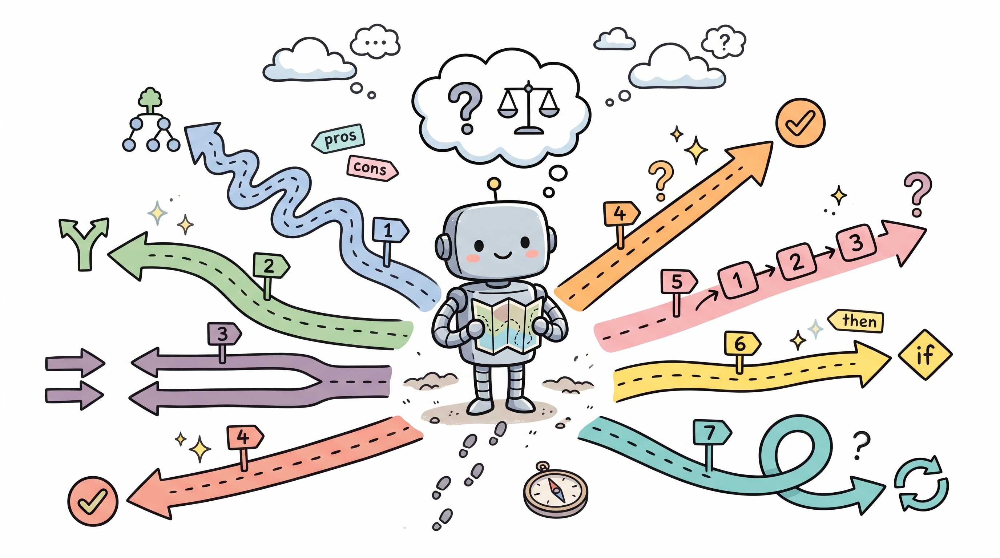

# Harness 工程实战（五）：七大架构决策——每个 Harness 设计者都必须回答的问题

---

设计一个 Harness 不是选技术栈。技术选型有文档可查，有社区经验可参考，GitHub 上有几千个参考实现。

真正的挑战是那些没有标准答案的问题：什么时候该拆 Agent？ReAct 还是 Plan-Execute？Harness 应该厚还是薄？这些问题背后是七个核心的架构决策。每个决策都需要根据具体场景来判断，而判断的依据是对 tradeoffs 的深入理解。



## 决策一：单 Agent 还是多 Agent

这是最常被问到的决策，也是最容易做错的决策。

Anthropic 和 OpenAI 都给了相同的建议：首先最大化单个 Agent。这不是随口说说，这是从大量实际案例中总结出来的经验。

多 Agent 系统看起来更强大——多个 Agent 并行工作、各司其职、听起来很优雅。但代价是显著的：

- **路由开销**：需要额外的 LLM 调用来决定"这个任务应该交给哪个 Agent"
- **上下文损失**：Agent 之间的交接会丢失上下文，特别是当一个 Agent 需要另一个 Agent 的中间结果时
- **状态复杂性**：管理多个 Agent 的状态比管理一个复杂 Agent 更难
- **调试难度**：多 Agent 的 bug 往往出现在 Agent 之间的交互中，而不是单个 Agent 内部

什么时候应该拆分？两个明确的触发条件：

**触发条件一：工具过载。**

当一个 Agent 需要使用大约超过 10 个重叠工具时，模型开始混淆。"我应该用哪个工具？"这个问题本身就开始消耗模型的推理能力。

更糟糕的是，工具越多，模型越倾向于选择错误的工具——不是模型不聪明，是选择空间太大了。

```python
# 工具过载的信号检测
def detect_tool_overload(tools: list[str], task: str) -> bool:
    """
    当任务涉及的工具超过 10 个时，考虑拆分。
    """
    relevant_tools = [t for t in tools if is_relevant(t, task)]
    return len(relevant_tools) > 10

# 按功能域拆分
class ToolRouter:
    """
    将工具路由到专门的子 Agent。
    """
    DOMAIN_TOOLS = {
        "file_operations": ["read_file", "write_file", "delete_file", "list_dir"],
        "code_analysis": ["grep", "search", "explain_code", "find_bugs"],
        "web_access": ["fetch_url", "search_web", "post_data"],
        "execution": ["run_command", "run_test", "deploy"],
    }

    def route(self, task: str) -> str:
        """决定任务应该交给哪个子 Agent"""
        relevant_domains = []
        for domain, tools in self.DOMAIN_TOOLS.items():
            if any(is_relevant(t, task) for t in tools):
                relevant_domains.append(domain)

        if len(relevant_domains) == 1:
            return relevant_domains[0]  # 单域任务，交给对应 Agent
        elif len(relevant_domains) > 2:
            return "coordinator"  # 多域任务，用协调 Agent
        else:
            return "general"  # 少工具，用通用 Agent
```

**触发条件二：明显独立的任务域。**

如果两个子任务需要完全不同的专业知识、完全不同的工具集、完全不同的上下文，那拆分几乎是必然的。

比如，一个 Agent 负责代码生成，另一个 Agent 负责代码审查。前者需要代码库的当前上下文，后者需要安全和质量的标准。这两个任务的上下文重叠很少，放在一起反而增加复杂度。

```python
class TaskDecomposer:
    """
    任务分解器：将复杂任务拆分为可并行的子任务。
    """

    def decompose(self, task: str) -> list[dict]:
        """
        返回子任务列表，每个子任务包含：
        - description: 任务描述
        - required_tools: 需要的工具
        - depends_on: 依赖的其他子任务
        """
        # 用模型判断任务是否需要拆分
        response = model.generate([{
            "role": "user",
            "content": f"""分析以下任务，判断是否可以拆分为独立的子任务：

{task}

如果可以拆分，返回 JSON 格式的子任务列表：
{{"subtasks": [
  {{"description": "...", "required_tools": [...], "depends_on": []}}
]}}

如果不需要拆分，返回：
{{"subtasks": [{{"description": "{task}", "required_tools": "auto", "depends_on": []}}]}}
"""
        }])

        data = json.loads(response.content)
        return data["subtasks"]
```

## 决策二：ReAct 还是计划-执行

这是另一个高频问题，而且答案高度依赖于任务特性。

**ReAct（Reasoning + Acting）** 在每一步交织推理和行动。模型思考"我应该做什么"，然后执行，再思考，再执行。

```python
class ReActAgent:
    """
    ReAct 模式的 Agent。
    """

    async def run(self, task: str, max_steps: int = 20):
        messages = [{"role": "user", "content": task}]

        for step in range(max_steps):
            # 1. 推理：让模型思考下一步
            thought = await model.generate(messages + [{
                "role": "assistant",
                "content": "让我思考一下当前情况..."
            }])

            # 2. 决定行动
            action = await model.generate(messages + [thought, {
                "role": "assistant",
                "content": "基于以上分析，我决定："
            }])

            # 3. 解析行动
            if action.tool_calls:
                for tc in action.tool_calls:
                    result = await self.execute_tool(tc)
                    messages.append({
                        "role": "tool",
                        "tool_call_id": tc.id,
                        "content": result
                    })
            else:
                # 没有工具调用，是最终答案
                return action.content

        return "Maximum steps reached"
```

**计划-执行（Plan-and-Execute）** 将规划与执行分离。模型先花时间制定完整计划，然后一次性执行。

```python
class PlanAndExecuteAgent:
    """
    计划-执行模式的 Agent。
    """

    async def plan(self, task: str) -> list[dict]:
        """先生成完整计划"""
        response = await model.generate([{
            "role": "user",
            "content": f"""为以下任务制定详细的执行计划：

{task}

输出格式：
[
  {{"step": 1, "action": "xxx", "reasoning": "为什么这样做"}},
  {{"step": 2, "action": "xxx", "reasoning": "..."}},
  ...
]
"""
        }])
        return json.loads(response.content)

    async def execute(self, plan: list[dict]):
        results = []
        for step in plan:
            result = await self.execute_step(step["action"])
            results.append({
                "step": step["step"],
                "result": result,
                "success": not is_error(result)
            })

            # 如果失败，根据情况决定是否继续
            if not results[-1]["success"]:
                if step.get("critical", False):
                    return {"success": False, "failed_at": step["step"], "results": results}
                # 非关键步骤失败，可以继续

        return {"success": True, "results": results}
```

LLMCompiler 的论文报告了一个重要数据：计划-执行比顺序 ReAct 快 3.6 倍。原因是：计划制定后，具体执行步骤可以并行，不需要每一步都等待模型思考。

但这有一个前提：任务可以提前规划。如果任务本身是探索性的（"帮我研究这个新框架"），你无法提前制定完整计划——需要先探索才能知道下一步该做什么。

选择规则：
- 探索性任务，目标是发现而非执行 → ReAct
- 执行路径清晰的任务，有明确的目标和步骤 → 计划-执行
- 混合任务：先用 ReAct 探索，锁定方向后切换为计划-执行

## 决策三：上下文窗口管理策略

这是第三章的延续，但这里关注的是架构选择而非具体实现。

五种策略各有权衡：

| 策略 | 适用场景 | 核心 trade-off |
|------|----------|----------------|
| 基于时间的清除 | 短对话、独立任务 | 简单实现，但可能丢失关键上下文 |
| 对话总结 | 长对话、多轮交互 | 保留大意，但细节可能丢失 |
| 观察遮蔽 | 工具调用密集场景 | 减少噪声，但需要仔细设计遮蔽规则 |
| 即时检索 | 大代码库、大文档 | 最精确，但增加延迟 |
| 子 Agent 委托 | 复杂探索任务 | 可扩展，但有通信开销 |

一个好的架构通常会组合使用多种策略：

```python
class AdaptiveContextManager:
    """
    自适应上下文管理：根据任务类型选择策略。
    """

    def __init__(self):
        self.time_based = TimeBasedEviction(max_turns=20)
        self.summarizer = SummarizingMemory(model, max_tokens=150000)
        self.masker = ObservationMasking()
        self.retriever = JustInTimeRetriever()

    async def build_context(self, task: str, history: list) -> list:
        # 判断任务类型
        task_type = self.classify_task(task)

        if task_type == "short_qa":
            # 短问答：用时间清除
            return self.time_based.get_relevant_context(task, history)

        elif task_type == "code_generation":
            # 代码生成：用即时检索
            return await self.retriever.get_relevant_files(task)

        elif task_type == "long_discussion":
            # 长对话：用总结
            return self.summarizer.get_context(task, history)

        elif task_type == "tool_heavy":
            # 工具密集：用观察遮蔽
            return self.masker.mask(history)

        else:
            # 默认：组合使用
            context = self.time_based.get_context(history)
            return await self.retriever.enrich_context(task, context)
```

## 决策四：验证循环设计

验证循环的设计直接影响系统的可靠性，但也带来成本。

**计算验证**（测试、linter）提供确定性真相。测试通过就是通过，失败就是失败，没有歧义。

```python
class ComputeVerification:
    """
    计算密集型验证。适用于代码、配置等可测试的输出。
    """

    def __init__(self):
        self.test_runner = TestRunner()
        self.linter = Linter()

    async def verify(self, output: dict) -> tuple[bool, str]:
        """
        返回 (是否通过, 详细信息)
        """
        results = []

        # 1. 运行测试
        test_result = await self.test_runner.run(output["test_path"])
        results.append(("tests", test_result.passed, test_result.details))

        # 2. 运行 linter
        lint_result = await self.linter.run(output["file_path"])
        results.append(("linting", lint_result.passed, lint_result.details))

        # 3. 类型检查（如果适用）
        if output.get("language") == "typescript":
            type_result = await self.run_typescript_check(output["file_path"])
            results.append(("types", type_result.passed, type_result.details))

        # 综合判断
        all_passed = all(r[1] for r in results)
        details = "\n".join([f"- {name}: {'PASS' if p else 'FAIL'}: {d}" for name, p, d in results])

        return all_passed, details
```

**推理验证**（LLM 作为评判者）可以捕获语义问题。输出是否满足用户意图？这个很难用测试定义，但 LLM 可以判断。

代价是：计算验证几乎零成本（毫秒级），推理验证有显著延迟（秒级）和费用。

一个好的架构设计通常两者都有：计算验证先行，拦住所有能用规则判断的错误；推理验证在后，处理需要语义判断的质量问题。

```python
class VerificationPipeline:
    """
    验证管道：先计算验证，再推理验证。
    """

    def __init__(self, model):
        self.compute_verifier = ComputeVerification()
        self.llm_judge = LLMJudge(model)

    async def verify(self, task: str, output: dict) -> tuple[bool, str]:
        # 第一层：计算验证（快速）
        compute_valid, compute_details = await self.compute_verifier.verify(output)
        if not compute_valid:
            return False, f"计算验证失败:\n{compute_details}"

        # 第二层：推理验证（深入）
        semantic_valid, semantic_details = await self.llm_judge.verify(task, output)
        if not semantic_valid:
            return False, f"语义验证失败:\n{semantic_details}"

        return True, f"验证通过。\n{compute_details}"
```

## 决策五：权限和安全架构

这是最容易在开发阶段被忽视的决策，但生产环境中会付出代价。

设计系统时，工程师通常假设一切正常。用户输入是合理的，工具调用是正常的，网络是通的。但生产环境中会有各种异常：恶意输入、工具调用超时、API 返回异常值、网络分区……

权限架构回答的问题是：Agent 在面对未知情况时，默认行为是什么？

**宽松模型**：快速行动，自动批准大多数操作。

```python
class PermissiveGuardrail:
    """
    宽松权限模型。适用于内部工具、低风险操作场景。
    """

    def check(self, tool_name: str, tool_args: dict, context: dict) -> bool:
        # 基本检查：参数格式是否正确
        if not self.validate_args(tool_name, tool_args):
            return False

        # 不做额外的安全检查，默认允许
        return True
```

**限制模型**：每个操作都需要确认。

```python
class RestrictiveGuardrail:
    """
    限制权限模型。适用于高风险操作、外部 API、数据敏感场景。
    """

    HIGH_RISK_TOOLS = {
        "delete_file", "exec_command", "send_email",
        "post_webhook", "modify_config", "database_write"
    }

    def check(self, tool_name: str, tool_args: dict, context: dict) -> bool:
        # 1. 基本验证
        if not self.validate_args(tool_name, tool_args):
            return False

        # 2. 高风险工具需要明确确认
        if tool_name in self.HIGH_RISK_TOOLS:
            return self.request_explicit_confirmation(tool_name, tool_args)

        # 3. 检查速率限制
        if self.is_rate_limited(tool_name):
            return False

        # 4. 检查操作频率异常
        if self.is_anomalous_frequency(tool_name):
            return False

        return True
```

Claude Code 管理约 40 个离散工具能力，分三个阶段建立信任：
- **项目加载时**：扫描项目结构，建立初始信任范围
- **每次工具调用前**：检查权限
- **高风险操作时**：需要用户明确确认

## 决策六：工具范围策略

更多工具通常意味着更差的性能。这个结论来自多个实际观察：

Vercel 从 v0 中删除了 80% 的工具，获得了更好的结果。不是因为删掉的工具没用，而是因为保留的工具让模型更容易做出正确选择。

Claude Code 通过延迟加载实现了 95% 的上下文减少——模型在某个步骤只需要知道当前可用的工具，不需要知道所有可能的工具。

```python
class ToolScopeManager:
    """
    工具范围管理器：根据上下文动态决定暴露哪些工具。
    """

    def __init__(self, all_tools: list):
        self.all_tools = {t.name: t for t in all_tools}

    def get_tools_for_context(self, context: dict, max_count: int = 10) -> list:
        """
        根据当前上下文返回最相关的工具集。
        """
        task = context.get("current_task", "")
        recent_tools = context.get("recent_tools_used", [])

        # 计算每个工具的相关性分数
        scores = {}
        for name, tool in self.all_tools.items():
            score = 0

            # 工具名称/描述与任务的相关性
            if any(word in name.lower() for word in task.lower().split()):
                score += 3

            # 最近使用的工具加分（时间和地点局部性）
            if name in recent_tools[-3:]:
                score += 2

            # 工具描述的关键词匹配
            if any(word in tool.description.lower() for word in task.lower().split()):
                score += 1

            scores[name] = score

        # 选择得分最高的工具
        sorted_tools = sorted(scores.items(), key=lambda x: -x[1])
        return [self.all_tools[name] for name, score in sorted_tools[:max_count]]
```

原则是：暴露当前步骤所需的最小工具集，而不是所有工具全集。

## 决策七：Harness 的厚度

这是最根本的架构押注。

**薄 Harness 方案**：模型是智能的来源，Harness 只做最少的事情。编排循环、工具调用、状态管理——所有"机械"的事情由 Harness 做，所有"思考"由模型做。

Anthropic 押注于薄 Harness。他们相信：随着模型变强，Harness 会自然变薄。现在需要的一些逻辑，在更强的模型里可能是多余的。

```python
# 薄 Harness 的典型实现
class ThinHarness:
    """
    薄 Harness：最小化的基础设施，让模型做推理。
    """

    def __init__(self, model, tools):
        self.model = model
        self.tools = {t.name: t for t in tools}

    async def run(self, task: str):
        messages = [
            {"role": "system", "content": "你是一个智能助手。"},
            {"role": "user", "content": task}
        ]

        while True:
            response = await self.model.generate(messages)

            if response.tool_calls:
                for tc in response.tool_calls:
                    result = await self.tools[tc.name].execute(**tc.args)
                    messages.append({"role": "tool", "content": result})
            else:
                return response.content
```

**厚 Harness 方案**：Harness 包含更多逻辑。规划步骤、策略选择、错误恢复——这些不是交给模型，而是显式写在 Harness 里。

LangGraph 押注于显式控制。他们认为有些事情 Harness 应该决定，不应该全部委托给模型。

```python
# 厚 Harness 的典型实现
class ThickHarness:
    """
    厚 Harness：显式控制流程，Harness 做决策。
    """

    async def run(self, task: str):
        # 1. Harness 做规划
        plan = await self.planner.create_plan(task)

        # 2. Harness 选择策略
        strategy = self.strategy_selector.select(plan, context)

        # 3. Harness 处理错误
        for step in plan.steps:
            try:
                result = await self.execute_step(step, strategy)
                if not self.validate_step(step, result):
                    # Harness 决定如何恢复
                    result = await self.recover(step, result)
            except Exception as e:
                # Harness 处理异常
                result = await self.handle_exception(step, e)
```

两种方案都有成功的案例，也都有失败的情况。

薄 Harness 的问题是：当模型能力不足时，系统会崩溃。Harness 没有备选方案，只能指望模型自己解决。

厚 Harness 的问题是：当模型能力超出 Harness 的假设时，Harness 可能成为瓶颈。模型能做得更好，但 Harness 不让。

选择取决于你的赌注：赌模型会变强，押薄 Harness；赌显式控制更可靠，押厚 Harness。

## 这七个决策之间的关系

这七个决策不是独立的，它们相互影响。

- 单 Agent vs 多 Agent → 影响工具范围策略的选择（多 Agent 需要更严格地控制每个 Agent 的工具暴露）
- ReAct vs 计划-执行 → 影响验证循环的设计（计划-执行更容易在步骤之间插入验证）
- 权限架构 → 影响 Harness 的厚度选择（限制模型需要更厚的 Harness 来执行权限检查）
- 工具范围 → 影响上下文管理（工具越少，上下文中工具定义占的空间越小）

在做这些决策时，想清楚它们之间的依赖关系，比单独研究每个问题更重要。

一个实用的方法：先确定最核心的两个决策（通常是"单/多 Agent"和"Harness 厚度"），然后围绕这两个决策展开其他选择。
