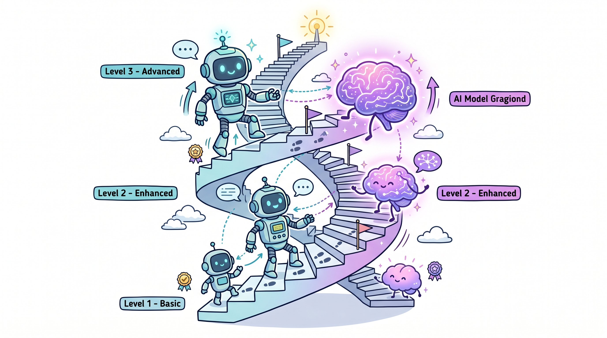

# Harness 工程实战（七）：模型与 Harness 的协同进化——左脚踩右脚的工程哲学

---

Manus 是一个 AI Agent 项目。他们在六个月内重写了五次系统。

每次重写都删除了复杂性。

这听起来不对。按照正常逻辑，随着项目发展，系统应该越来越复杂。代码越写越多，功能越加越多，模块越拆越细。为什么他们的系统越写越简单？

因为模型在变强。

最初需要复杂编排才能实现的功能，新版模型直接就能做。原本需要的"管理 Agent"变成了简单的结构化交接。原本需要的复杂工具定义变成了通用 shell 执行。原本需要的"验证循环"变成了模型自带的自我检查能力。

这是 Harness 演化的一个缩影，也是整个 AI 应用行业的缩影。



## 脚手架隐喻：临时性的基础设施

建筑脚手架是干什么的？

它不是用来建造的。脚手架本身不能砌墙、不能浇混凝土、不能安装窗户。它只是一个临时设施，让工人能够到达他们无法触及的高度。

但没有脚手架，工人就无法工作。脚手架是建造的必要条件，但不是建造本身。

关键洞察是：建筑完成后，脚手架会被拆除。

这个类比对理解 Harness 至关重要。Harness 是模型能力的"脚手架"——它让模型能够完成那些它凭自身能力做不到的事情。但随着模型变强，Harness 需要不断简化，直到最终被拆除。

Vercel 的 v0 是一个典型案例。他们最初设计了一个复杂的工具集，让 AI 能够完成各种前端开发任务。但随着 Claude 模型能力的提升，他们发现 80% 的工具变得多余——模型可以直接用更简单的方式完成同样的任务。他们删掉了 80% 的工具，系统反而变得更快、更稳定。

Anthropic 定期从 Claude Code 的 Harness 中删除规划步骤。原因是新模型版本内化了该能力——模型已经学会了在生成代码之前先制定计划，不需要 Harness 来强制这个行为。

如果你的 Harness 今天需要做某件事，不代表它明天还需要做这件事。这是一个让人不安的事实，但对于在 AI 应用领域工作的人来说，这是必须接受的事实。

## Claude Code 的秘密：模型学会了它训练时的 Harness

Claude Code 的模型学会了它训练时使用的特定 Harness。

这句话值得仔细理解。

Anthropic 不是只训练了一个模型然后让它随便跑。他们训练模型时，使用了特定的工具调用模式、特定的上下文管理策略、特定的验证流程。模型在训练中学会了"使用它训练时使用的特定 Harness"。

这意味着 Claude Code 的 SDK 不只是一个"调用模型的工具"——它本身是模型训练数据的一部分。当你使用 Claude Code 的 SDK 时，你实际上是在使用一个专门为这个 SDK 优化的模型。

这带来一个反直觉的结论：如果你改变工具的实现方式，性能可能会下降。

具体来说：如果你的工具定义、上下文管理方式、验证流程和模型训练时使用的不一致，模型可能无法发挥最佳性能。因为模型已经学会了某种特定的工作方式——当你改变这个工作方式时，模型需要重新适应。

这个发现对 Harness 设计有深远的影响：

1. **工具定义的稳定性很重要**。如果你频繁改变工具的名称、描述、参数格式，模型可能需要时间重新学习。
2. **Harness 的设计是一种对模型能力的押注**。你赌的是模型会往某个方向发展，然后你的设计能适应这个方向。
3. **最好的 Harness 设计师不是让模型适应 Harness，而是让 Harness 适应模型的能力边界**。

## 协同进化：左脚踩右脚的螺旋

用更好的芯片开发下一代芯片，这是半导体行业的摩尔定律。

这条定律的神奇之处在于它是循环的：更好的芯片可以设计更好的芯片，更好的芯片又可以开发出更好的芯片。每一次循环，芯片的性能都提升一个级别。

AI 行业也在发生同样的事情。

用更好的模型开发更好的 Harness，用更好的 Harness 开发更好的模型。这是 AI 行业的协同进化。

模型变强，让更薄的 Harness 成为可能。更薄的 Harness 让模型的能力更容易发挥。更好的发挥产生更好的结果。更好结果让人们愿意投入更多资源开发更强的模型。

这不是循环，是螺旋。每一次循环，系统整体提升一个级别。

Manus 六个月重写五次的意义就在这里。他们不是在修复 bug——如果是在修复 bug，应该越修越复杂。他们是在追赶上模型进步带来的红利。每次模型变强，旧的复杂性就不再生效。他们在不断重新发现"现在什么才是真正需要的"。

这个过程有几个关键阶段：

**第一阶段：Harness 弥补模型不足。**

在这个阶段，模型能力有限，需要复杂的 Harness 来引导它完成特定任务。Harness 包含大量的逻辑：规划步骤、验证规则、错误恢复策略。

**第二阶段：模型吸收 Harness 的部分功能。**

随着模型能力提升，它开始能够自主完成之前需要 Harness 引导的任务。Harness 中的某些逻辑变成了多余。

**第三阶段：Harness 简化。**

删除冗余的 Harness 逻辑。系统变得更简单，但功能没有减少。

**第四阶段：回到第一阶段。**

新模型发布，带来新的能力边界。又需要新的 Harness 来实现新的功能。

这个循环不断重复。每次循环，系统的能力上一个台阶，Harness 的复杂度不一定增加。

## Manus 案例：工程实践的教训

Manus 的工程实践提供了几个重要的教训。

**教训一：重写是必要的，不是失败。**

很多工程师害怕重写——它意味着之前的工作白做了，意味着承认之前的设计是错的。但在 Harness 工程中，重写是进步的标志。每次重写都意味着你跟上模型能力的最新状态。

关键是如何重写。Manus 的重写不是推倒重来，而是渐进式简化。每次重写都删除复杂性，同时保持功能不变。

```python
# 重写前的复杂实现
class OldAgent:
    def __init__(self, model):
        self.model = model
        self.planner = Planner(model)      # 需要单独的 planner
        self.executor = Executor(model)    # 需要单独的 executor
        self.verifier = Verifier(model)    # 需要单独的 verifier
        self.memory = ComplexMemory()      # 需要复杂的记忆系统
        self.strategy_selector = ...       # 需要策略选择器

    async def run(self, task):
        # 复杂的协调逻辑
        plan = await self.planner.create_plan(task)
        for step in plan.steps:
            result = await self.executor.execute(step)
            verified = await self.verifier.verify(step, result)
            if not verified:
                # 处理验证失败
                ...
        return result


# 重写后的简化实现
class NewAgent:
    def __init__(self, model):
        self.model = model
        # 只需要简单的工具定义，不需要复杂的协调逻辑

    async def run(self, task):
        # 模型自己处理规划、执行、验证
        # Harness 只需要提供正确的工具和环境
        return await self.model.generate(task, tools=self.tools)
```

**教训二：复杂性是债务，不是资产。**

很多工程师把复杂性当作"功能丰富"的标志。系统越复杂，越显得"专业"。但在 Harness 工程中，复杂性是债务——它意味着你需要维护更多的代码、更高的测试成本、更难的调试。

好的 Harness 设计是删除代码而不是添加代码。每次加功能之前先问：模型现在能不能自己做到？如果能，就不加。

**教训三：跟踪 Harness 的价值。**

不是所有的 Harness 逻辑都应该随着模型变强而被删除。有些逻辑是 Harness 的核心价值，不依赖于模型能力。

如何区分？问一个问题：当模型变强时，这部分逻辑是否变得多余？

如果是，说明它是临时性的脚手架，可以删除。

如果不是，说明它是基础设施的核心部分，需要保留。

```python
class HarnessValueTracker:
    """
    跟踪每个 Harness 组件的价值。
    """

    def __init__(self):
        self.components = {}

    def register(self, name: str, description: str, rationale: str):
        """注册一个 Harness 组件"""
        self.components[name] = {
            "description": description,
            "rationale": rationale,  # 为什么需要它
            "model_dependent": True  # 是否依赖模型能力
        }

    def should_keep(self, name: str, model_version: str) -> bool:
        """
        判断组件是否应该在当前模型版本中保留。
        """
        component = self.components.get(name)
        if not component:
            return False

        # 如果组件依赖于模型能力，检查模型是否已内化该能力
        if component["model_dependent"]:
            return not self.model_has_builtin_capability(
                name, model_version
            )

        # 不依赖模型能力的组件，始终保留
        return True

    def model_has_builtin_capability(self, name: str, model_version: str) -> bool:
        """
        检查模型是否已经内置了某个能力。
        这需要跟踪模型版本的发布说明。
        """
        capabilities = {
            "planner": ["claude-3.5", "gpt-5"],  # 这些版本内置了规划能力
            "verifier": ["claude-4", "gpt-5"],
            "strategy_selector": [],  # 还没有模型内置这个
        }

        return model_version in capabilities.get(name, [])
```

## Harness 的未来验证测试

怎么判断一个 Harness 设计是否面向未来？

一个简单的测试方法：**用更强的模型跑相同的任务**。如果性能提升了，但 Harness 复杂性没有增加，说明设计是合理的——模型变强带来的收益没有被过度的 Harness 复杂性抵消。

更严格的测试是：**模型变强后，你是否能够删除某些 Harness 逻辑？**

如果答案是"是"，说明你的 Harness 中确实有部分是"脚手架"，在模型更强后可以去掉。这不是失败，这是进步。

如果答案是"否"，可能有两种情况：
1. 你的任务本身就确实需要这些逻辑（它们是真正的"基础设施"）
2. 你的 Harness 设计过度依赖模型的某些弱点

好的 Harness 设计师会定期问自己：现在写在 Harness 里的这些东西，有多少是真正必要的，有多少是因为模型还不够强所以不得不做的妥协？

```python
class HarnessAudit:
    """
    定期审查 Harness 的必要性。
    """

    def __init__(self, harness, model):
        self.harness = harness
        self.model = model

    async def audit(self, test_tasks: list) -> dict:
        """
        运行审查，评估每个组件的必要性。
        """
        results = {}

        for component_name, component in self.harness.components.items():
            # 测试有该组件和无该组件的差异
            with_component = await self.run_with_component(component)
            without_component = await self.run_without_component(component)

            delta = with_component.quality - without_component.quality

            results[component_name] = {
                "quality_delta": delta,
                "necessary": delta > 0.05,  # 如果质量差异超过 5%，认为是必要的
                "recommendation": "keep" if delta > 0.05 else "consider_removing"
            }

        return results
```

## 关于"被模型取代"的恐惧

很多 Harness 工程师有一个隐藏的恐惧：随着模型变强，Harness 工程师的工作会不会被取代？

这个恐惧的核心是：Harness 工程师的价值在于"弥补模型的不足"。如果模型不需要弥补了，Harness 工程师还有什么价值？

但这个逻辑是错的。

首先，Harness 工程不是弥补模型的不足——它是把模型能力转化为用户价值。模型能做的事情很多，但不是所有事情都对用户有用。Harness 工程师的工作是找到那个把模型能力转化为用户价值的切入点。

其次，即使模型能自主完成所有任务，不同的 Harness 设计仍然会产生完全不同的用户体验。Claude Code 和 GitHub Copilot 背后的模型可能相似，但用户体验完全不同。Harness 设计师的品味和判断力仍然重要。

最后，也是最重要的：模型能力的边界在不断扩展，Harness 工程师的工作也在不断扩展。今天的"弥补不足"，可能变成明天的基础设施核心需求。

作为工程师，只要你是在做最前沿的 Harness，永远也无需担心会被模型取代。因为最好的 Harness 设计本身，就是一种对模型能力的押注——你在赌模型往某个方向发展，然后你的系统能适应这个方向。

如果你赌对了，你的系统会因为模型进步而变强。如果赌错了，你需要重构。

这不是被取代，这是共进化。

就像芯片工程师不会被更先进的 EDA 工具取代——他们用更好的工具设计下一代芯片。工具变强了，工程师的工作也变强了。

## 动态过程：Harness 工程没有终点

最关键的一点：Harness 工程是动态的，不是有终点的。

很多人把"Harness 设计"当成一个项目：立项、开发、上线，结束。软件工程思维——需求明确、设计完成、实现交付、维护上线、生命周期结束。

但如果模型在不断进步，而 Harness 的设计又和模型能力紧密耦合，那 Harness 设计就不可能有一个终点状态。

今天设计的 Harness，三年后可能面目全非。不是因为做错了，是因为模型变了，任务变了，整个系统都在变。

接受这个动态过程，是 Harness 工程师和传统软件工程师最大的思维差异。

传统软件工程师在设计稳定不变的系统——一旦上线，需求就固定了，代码只需要维护，不需要重新设计。

Harness 工程师在设计一个必须跟着模型一起演化的系统——每次模型升级，都可能需要重新评估设计决策。

这更难。也更有意思。

因为每一次模型的进步，都意味着新的可能性。而发现这些可能性并把它们变成现实，正是 Harness 工程师的工作。
