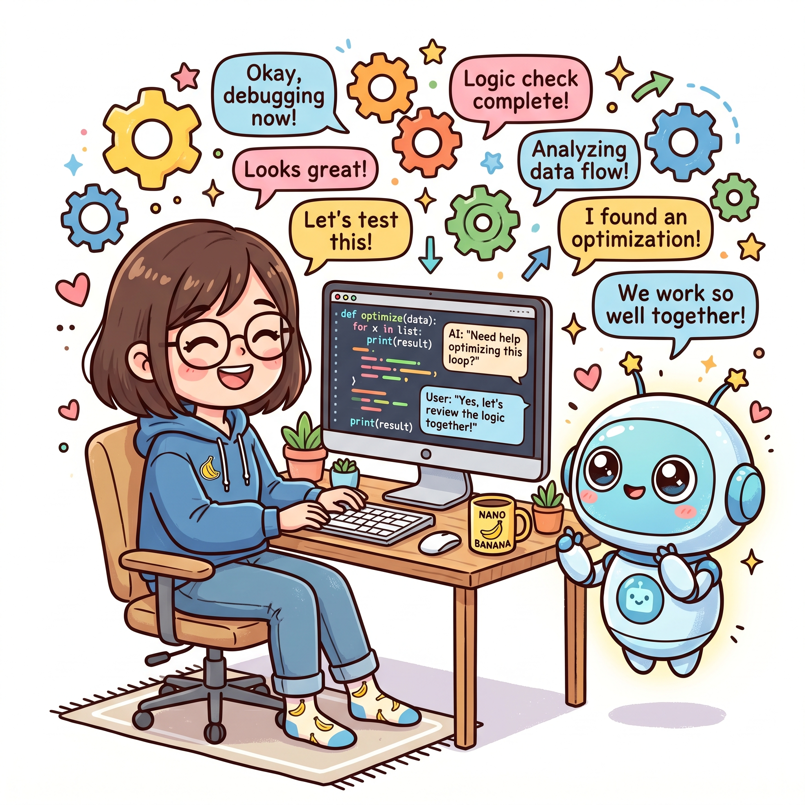

# Vibe Coding 实战（七）：迭代优化——从原型到生产质量

---

第一次用 vibe coding 写出来的代码，总是带有一股"临时感"。不是说不能用，而是总觉得哪里不对——变量命名有点随意，函数拆分不够干净，边界情况没考虑全，注释也只是把函数名翻译了一遍。这种代码跑得起来，上线的时候心里却没底。

这很正常。AI 生成代码的逻辑是"先把东西弄出来"，而不是"一步到位做到最好"。你给 AI 一个 prompt，它在几秒内给你一个可运行的方案，这个方案的质量取决于你的 prompt 质量、上下文信息量，以及 AI 模型本身的能力边界。所有这些因素加在一起，第一版输出大概率是个"能跑但粗糙"的版本。

所以 vibe coding 的核心竞争力，不是"能不能让 AI 写代码"，而是"会不会迭代优化"。

## 为什么第一版几乎从不是最终版

我见过很多人用 vibe coding 的模式是这样的：给 AI 一个需求描述，AI 吐出一段代码，复制粘贴到项目里，测试一下——能跑，行，就用这个。表面上效率很高，实际上欠了一屁股技术债。

AI 生成的第一版代码有几个天然的局限。

**上下文压缩问题**。AI 的上下文窗口是有限的，你不可能把整个项目的所有细节都塞进去。当 AI 生成某个函数的时候，它对这个函数的理解来自于你给它的那些描述——而这些描述往往是片面的。AI 不知道你们团队的编码规范，不知道这个函数以后会被哪些其他模块调用，不知道你们线上环境有什么特殊限制。所以 AI 生成的代码是在"信息不完整"的前提下做的决策，质量自然有上限。

**统计最优 vs 场景最优**。大语言模型生成代码的机制，是预测"在给定上下文中，下一个 token 最可能是什么"。这个预测基于海量开源代码的训练数据，所以 AI 天然倾向于生成"统计上最常见"的实现方式。这套机制在大多数情况下有效，但遇到具体业务场景的特殊需求时，统计最优解往往不是场景最优解。比如你们系统里日期处理全部用 UTC，但 AI 不知道这件事，它可能会按照本地时间的惯例来处理，埋下一个时区 bug。

**缺乏对"为什么要这样写"的理解**。AI 能写出代码，但不理解代码背后的业务逻辑和架构约束。它不知道这个函数被高频调用所以需要考虑性能，不知道那个模块马上要重构所以不需要写太完善，不知道测试团队对某个边界条件特别敏感。这些信息只有你知道，但 AI 读不到你的脑子。

认识到这些局限，是做好 vibe coding 的第一步。不要期待 AI 一次给出一个完美的解决方案，而是把第一版当作一个起点——一个可以快速验证思路的原型，一个可以迭代打磨的草稿。

## 迭代路径：生成 → 审查 → 校正 → 再生成

我现在的 vibe coding 工作流，已经形成了一个稳定的循环：生成代码之后，不是直接用，而是先审查，找出问题，然后给 AI 具体的反馈，让它重新生成，如此往复，直到代码质量达到上线标准。

### 第一步：生成

这一步没什么特别的，就是正常写 prompt，让 AI 输出代码。关键点在于 prompt 要写得够清楚——但这里有个度的问题。太模糊了，AI 生成的代码方向可能就不对；太具体了，又限制了 AI 的发挥空间。我的经验是：描述清楚"做什么"和"为什么要这样做"，但不要规定"怎么做"。

举个例子，你想写一个缓存失效的逻辑。与其说"写一个每 5 分钟清理一次过期缓存的定时任务，使用 ConcurrentHashMap 存储"，不如说"需要一个缓存失效机制，我们的场景是数据更新频率不高但读取频率很高，要求缓存命中率高、内存占用可控"。前者把实现细节写死了，后者给 AI 留了发挥空间，同时给了足够的业务上下文。

生成之后，我会先快速跑一下——看编译能不能过，逻辑上有没有明显漏洞。这个阶段的审查不用太细，主要目的是排除明显错误。

### 第二步：审查

审查环节是迭代优化中最重要的一步，也是大多数人最容易跳过的。

我审查代码的时候，通常关注这几个维度。

**正确性**：这个函数在各种输入下都能正确工作吗？空值、异常值、边界情况都考虑到了吗？这一点 AI 容易出问题，因为它倾向于假设"正常情况"，而忽略那些"理论上不会发生但实际上会"的场景。

**可读性**：变量命名清晰吗？函数长度合适吗？逻辑复杂度高吗？我之前写过一篇关于代码可读性的文章，核心观点是"代码是写给人看的，顺手给机器跑而已"。AI 生成的代码在这方面往往有进步空间——命名随意、函数过长、嵌套层次多，都是常见问题。

**可维护性**：这段代码以后改起来方便吗？如果需求变了，需要动几个地方？如果其他模块要调用这个函数，需要理解多少背景知识？好的代码应该是"低耦合、高内聚"的，AI 有时候会写出功能正确但耦合混乱的代码。

**性能**：在生产环境的负载下，这段代码会成瓶颈吗？有没有明显的性能问题，比如在循环里查数据库、在高频调用路径上做不必要的计算？

审查的方式我推荐两种结合用。一种是"静态审查"——直接读代码，用眼睛找问题，不需要跑起来。这种方式适合快速排除明显问题。另一种是"动态审查"——实际跑一下，写几个测试用例，看代码在不同输入下的表现。两种方式各有优势，结合起来效率最高。

### 第三步：校正

审查完之后，把问题总结成具体的反馈，告诉 AI 哪里需要改。这一步有几个技巧。

**反馈要具体，不要抽象**。不要说"这段代码不够好"，要说"这个函数有 80 行了，拆成两个函数，一个处理数据准备，一个处理业务逻辑"。具体的反馈能让 AI 精准理解问题，抽象的反馈只会让 AI 给你一个"优化版"但问题依旧。

**一次不要反馈太多**。我一般控制在三到五个问题之内。反馈太多的话，AI 可能顾此失彼，或者为了同时解决所有问题而写出更复杂的代码。分批次来，每次解决一批问题，迭代效率更高。

**必要时直接上手改**。有些小问题——比如变量命名、注释格式、import 顺序——与其让 AI 重新生成，不如自己直接改掉。这些改动很简单，你花 30 秒改掉，比等 AI 重新生成一段 200 行代码然后再对比差异要快得多。vibe coding 不是"完全不动手"，而是"把动手的价值用在刀刃上"。

### 第四步：再生成

把校正反馈给 AI，让它重新生成代码。然后回到审查步骤，看改得怎么样。

这个循环通常会重复两到三轮。我的经验是，大部分代码经过两到三轮迭代后，质量就能达到"可接受"的标准。超过三轮还没明显改善的话，我会停下来重新思考——是需求描述不够清楚，还是这个功能本身有复杂度需要重新设计？

## 小步迭代 vs 大步重写：什么时候选哪个

迭代优化不是盲目地一遍遍让 AI 改代码。有时候小步迭代是正确选择，有时候推倒重来反而更快。判断什么时候用什么，经验的成分很大，但有几个原则可以参考。

**小步迭代适合的场景**：功能方向是对的，代码结构大致可行，问题是局部的、可修复的。比如变量命名不好、函数过长、缺少边界检查、注释不清晰——这些都属于"改一改就能好"的问题，用不着重写。重写反而浪费时间，而且可能引入新的问题。

**大步重写适合的场景**：第一版代码的方向就偏了，比如选错了技术方案、架构设计有问题、或者需求本身理解错了。这种情况下迭代下去只是在错误的基础上打补丁，不如重新来。还有一种情况是代码已经改过很多轮，变得越来越复杂混乱，自己都看不懂了——这是技术债积累到一定程度的信号，重写比继续迭代更划算。

**一个实用的判断标准**：如果一个模块改了三轮以上还没有达到满意的质量，我就会考虑重写，而不是继续迭代。这个标准不是绝对的，但作为一个触发点很有用。三轮还没改好，通常说明问题不在细节，而在方向。

还有一种情况值得单独说一下：有时候你发现 AI 生成的第一版代码"看起来还行"，但你隐约觉得哪里不对，却说不清楚具体是什么。这种感觉往往是对的——你的经验和直觉在告诉你，这段代码有潜在问题，只是还没有暴露出来。我的做法是相信这种感觉，先不要急着上线，而是多花点时间深入理解这段代码：它为什么这样写？有没有更好的实现方式？如果以后需求变了，这段代码能应对吗？想清楚这些问题之后，再决定是迭代还是重写。

## 代码质量持续提升的实践方法

迭代优化不只是在单个模块上反复修改，而是一种持续的习惯。下面几个实践方法帮我把代码质量维持在较高水平。

**写完就测，不要等**。很多人在 vibe coding 模式下有个坏习惯：AI 生成代码，自己复制粘贴到项目里，然后就不管了，等着后面集成测试或者 QA 环节来发现问题。这个顺序反了。单元测试应该在代码写完的时候就写，而不是等集成的时候补。AI 生成代码的同时，你可以让它顺便生成测试用例——这不需要额外的时间，但能帮你提前发现问题。我现在的习惯是，每次 AI 生成一个函数，我就让它同时生成对应的单元测试。如果测试跑不过，我会把错误信息贴给 AI，让它同时修复代码和测试。

**用 lint 工具做基础检查**。ESLint、Prettier、TypeScript 编译器——这些工具能做很多重复性的代码质量检查，比如未使用的变量、类型错误、格式不统一。把这些工具配置好，让它们在保存文件的时候自动跑一遍，AI 生成代码里的大部分基础问题就能被自动发现和修复，不需要你逐个手动检查。我现在用 Cursor 写代码，ESLint 和 Prettier 都已经配置好了，每次保存都会自动格式化代码，AI 生成的代码如果格式有问题，下一秒就被自动修正了。

**定期 review 自己攒的代码**。vibe coding 模式下，你的代码库里会有大量 AI 生成的代码。这些代码可能分散在各个模块，当时写的需求背景、使用限制、注意事项，现在可能已经记不清了。我建议每个月抽一个下午，把这个月 AI 生成的代码过一遍——不是一行行读，而是看看整体结构、命名风格、注释质量有没有退化。如果发现某个模块的代码越来越乱，说明这个模块的上下文积累有问题，可能需要重构或者补更多的 context 给 AI。

**建立自己的代码质量 checklist**。每个人的项目特点不一样，遇到的问题也不一样。我建议根据自己的经验，总结一个适合自己的检查清单。比如我的 checklist 里有一条是"所有对外暴露的接口都要有参数校验"，还有一条是"数据库操作必须放在事务里"。每次 AI 生成完代码，我会对照 checklist 快速过一遍，看有没有遗漏。这个习惯帮我规避了很多线上故障。

## 从粗糙到可用：一次真实的迭代经历

说一个具体的例子，来说明迭代优化是怎么工作的。

有一次我需要写一个文件上传功能，具体需求是：用户上传图片，服务器端压缩图片，然后存储到 S3。听起来不复杂对吧？

AI 的第一版输出大约 80 行代码，基本逻辑是对的，但有几个问题：压缩参数硬编码了、没有处理文件类型校验、错误处理只是简单抛异常、没有考虑大文件导致的内存问题。

第一轮迭代，我反馈了这些问题。AI 给出了第二版，加了文件类型白名单和基本错误处理，但压缩参数还是硬编码的，而且新增了一个问题——异步处理没处理好，可能导致响应超时。

第二轮迭代，我继续反馈。这次 AI 把硬编码改成了配置项，增加了超时处理和重试逻辑。但我 review 的时候发现，异步处理那块用了简单的 Thread.sleep，这不是好的实现方式，而且代码复杂度明显增加了。

第三轮迭代，我问 AI 有没有办法简化异步处理的逻辑。AI 给出了一个更优雅的方案——用 CompletableFuture 和合理的线程池配置，代码行数反而比上一版少了。跑了一下测试，各方面都达标了。

从粗糙到可用，三轮迭代，每次都有具体的进步。这个过程听起来比"一次生成直接用"要慢，但考虑到最终代码的质量和后续维护成本，这个投入是值得的。

## 迭代优化的心态

最后聊一个我觉得很重要但容易被忽略的点：心态。

vibe coding 模式下，代码是 AI 生成的，但责任是你的。你需要对代码质量负责，但不需要对"每一行代码都是自己写的"这件事有执念。AI 生成的第一版是草稿，不是成品。把心态从"我写的代码"切换到"我负责的代码"，迭代优化就不再是一个负担，而是一个自然而然的过程。

很多人对 vibe coding 有一个误解，觉得它是"让 AI 替我写代码"，所以自己应该尽量少动手。恰恰相反，vibe coding 要求你更主动地介入——更仔细地审查、更频繁地测试、更果断地重构。你不是在写代码，你是在"导演"代码的生产过程。

迭代优化就是这样一个导演的过程。第一版剧本出来了，审查一下，标注问题，让编剧改，改完再审查，再标注，再改——直到剧本达到可拍摄的标准。这个过程里，导演不是在偷懒，而是在做最重要的工作：确保最终成品的方向和质量。

下次你用 AI 生成一段代码的时候，别急着复制粘贴。先问自己三个问题：这代码对吗？这代码清晰吗？这代码以后改起来方便吗？如果任何一个答案是否定的，就进入迭代流程。几次下来，你会发现自己的 vibe coding 能力在肉眼可见地提升。
