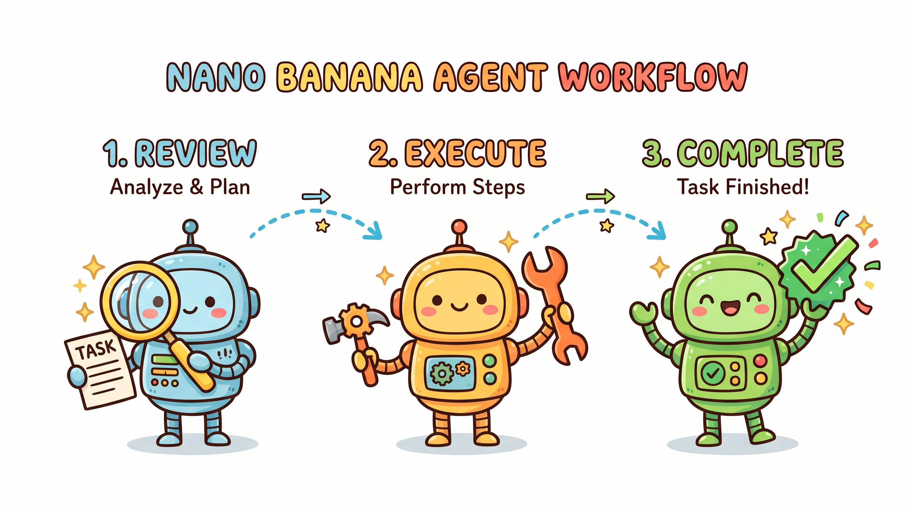

# Vibe Coding 实战（九）：Agent 模式——让 AI 自主完成多步任务

---

普通模式下，你给 AI 一个 prompt，它生成一段代码，你复制粘贴到项目里，结束。这套模式适合简单的、一步到位的任务——查个用法、补一段函数、解释一段报错。但当任务变得复杂，需要多步操作、需要读写文件、需要反复验证结果的时候，普通模式就开始力不从心了。你要不断重复"给 prompt → 看结果 → 再给 prompt"这个循环，累且容易出错。

Agent 模式解决的就是这个问题。在 Agent 模式下，你给 AI 一个目标，AI 会自主规划行动步骤，执行一系列操作（读文件、写文件、运行命令、调用工具），中途根据执行结果调整策略，直到任务完成或者遇到无法解决的问题为止。你不需要一步步指挥，只需要描述清楚你要什么，然后看着 AI 自己把事情做完。

这套模式不是银弹。用得好，它能帮你省大量时间；用得不好，它会以一种非常彻底的方式把事情搞砸。知道什么时候用、怎么监控、什么时候叫停，比会用这个功能本身更重要。

## 什么任务适合 Agent 模式

Agent 模式的核心价值是"自动化重复性多步骤操作"。适合它的任务通常有几个特征：步骤多、涉及文件读写、需要根据中间结果调整下一步、且失败成本可控。

举几个典型的适用场景。

**大规模重构**。比如你想把所有 `var` 声明改成 `const`，或者把所有 class 组件改成函数组件。这类任务本质上是"对大量文件做同样的修改"，手工做枯燥且容易漏，Agent 模式可以自主遍历项目里的相关文件，逐个修改并验证。

**生成测试用例**。给 Agent 一个模块，让它读取源码，理解接口，然后生成单元测试。Agent 可以自主决定需要测哪些场景、构造什么数据、写什么断言。

**文档生成**。给 Agent 你的代码库，让它读取所有公开接口的源码，生成 API 文档或者架构说明。这类任务涉及大量文件读取和文本生成，Agent 模式比手工整理效率高得多。

**搭建项目骨架**。描述你想要的项目结构和技术栈，让 Agent 生成初始代码、配置文件、目录结构。这也是一个典型的多步骤任务，Agent 可以自主创建目录、写入文件、配置依赖。

那什么任务不适合 Agent 模式？

**需要精确业务判断的任务**。比如"这段逻辑要改成这样，因为业务上有个特殊需求"——Agent 不理解你的业务，它只能按它认为合理的方式处理。业务逻辑的变更需要人来做判断，Agent 负责执行。

**高风险线上操作**。跑 migration 脚本、删数据、改配置——这些操作一旦出错代价极高。Agent 模式有自主权，如果它理解错了你的意图，自作主张执行了一个破坏性操作，后果很难挽回。

**高度创新的设计任务**。Agent 擅长"按规矩做事"，不擅长"发明新东西"。如果你要做的是一个全新的系统架构、设计一套前所未有的交互模式，这类任务需要人来做创造性决策，Agent 帮不上太多忙。

一个简单的判断标准是：如果这个任务可以写成"一步一步怎么做"的明确步骤，用普通模式可能更安全；如果这个任务的步骤需要根据实际情况动态调整，Agent 模式更合适。

## Agent 模式的局限性

Agent 模式听起来很美，但有几个根本性的局限你需要清楚。

**上下文窗口仍然是有限的**。即使在 Agent 模式下，AI 能处理的上下文信息量也是有限的。当项目很大、文件很多的时候，Agent 不可能一次读完所有相关文件。它会尽量读，但可能会遗漏某些重要文件，或者因为读了太多而记不住之前的内容。这个局限性导致 Agent 在超大型项目里的表现不稳定——有时候它能准确处理，有时候会犯一些"读了就能避免"的低级错误。

**自主决策可能偏离目标**。当 Agent 获得了执行权限，它会在你不盯着的时候做决策。有些决策是对的，有些是错的，还有些表面看起来对但实际上偏离了你的本意。比如你让 Agent 重构一个模块，它可能把重构方向理解错了，花了 20 分钟生成一堆代码，最后发现根本不是你想要的。这种情况在复杂任务里并不罕见。

**错误会级联放大**。在多步骤任务里，第一步的错误可能会导致后续所有步骤都建立在错误的基础上。Agent 执行了一个错误的操作，然后基于这个错误的结果继续执行下一步，最终产出完全跑偏。这种错误在事后复盘的时候往往会发现"如果当初在第三步停下来检查一下就好了"，但 Agent 在执行的时候不会主动停下来问。

**无法感知"业务价值"**。Agent 能执行你给它的指令，但它不理解这个指令背后的业务价值。有一次我让 Agent 批量处理一批数据文件，它很高效地把所有文件都处理完了，但处理的方式完全不是我想要的——它按文件名排序处理，而我需要按日期排序处理。文件处理本身没有错，但它没有理解我排序这个需求背后的业务逻辑。这个例子说明，再聪明的 Agent 也无法替代人对业务目标的说清楚。

## 监控和干预：不让 AI 走偏

Agent 模式的核心风险是"AI 在做你不想要的事情，但你没有及时发现"。所以监控和干预机制比普通模式重要得多。

**开始任务前，把约束写清楚**。在给 Agent 下达任务的时候，把"不能做什么"和"必须满足什么条件"说清楚。比如"修改所有 .ts 文件里的 console.log，把它们替换成 logger.info"——这句话本身是清楚的，但如果 Agent 理解错了，它可能会把 `console` 变量名也改了、把日志内容也改了、把无关的 console 调用也改了。所以约束要具体：只改 `console.log(...)` 这一行调用，替换成 `logger.info(...)`，参数保持原样，不改别的任何东西。

**关键步骤设置检查点**。Agent 执行一个复杂任务的时候，不要等到最后再看结果。在关键步骤完成后，主动查看 AI 做了什么。我现在的做法是，每完成一个文件或者一个模块的处理，就让 Agent 停下来汇报进展，我确认没问题再让它继续。这个节奏会拖慢一点，但大幅降低了"做完了才发现全错了"的风险。

**保留中断的能力**。Agent 模式运行的时候，你要有能力随时叫停。Cursor 和 Claude Code 都支持在 Agent 执行过程中手动停止。养成习惯：每隔几分钟检查一次 Agent 的进度，如果发现方向不对，立刻停止，不要等它把错误做完。

**验证输出的正确性**。Agent 完成后，不要假设它做对了。用测试、lint、编译等工具验证输出是否符合预期。如果项目有 CI/CD 流程，Agent 完成后跑一遍自动化测试是必要的。

有一次我用 Agent 模式批量重构代码，花了十几分钟，Agent 声称完成了 30 个文件的修改。我让它停下来汇报，它列出了所有修改的文件和修改内容。我抽查了几个文件，发现大部分是对的，但有两个文件的修改方式不对——它把一些不该改的代码也改了。我把这两个文件恢复到修改前的状态，手动修复，然后让 Agent 继续处理剩余文件。如果我没有在中间停下来检查，这两处错误就会留到代码库里。

## 多轮 Agent 协作的策略

当你需要处理一个非常复杂的任务时，单个 Agent 可能无法从头做到尾。这种情况下，可以考虑把任务拆分，让多个 Agent 分别处理不同的部分，最后合并结果。

**拆分的原则**。每个子任务应该是相对独立的、边界清晰的。一个 Agent 负责数据层（读写数据库相关），一个负责业务逻辑层，一个负责接口层——这样的拆分是合理的，因为各层之间的依赖关系是明确的。如果拆分出来的子任务互相高度依赖，Agent 之间的协作成本会很高，不如让单个 Agent 按顺序处理。

**上下文传递**。多个 Agent 处理同一批文件时，上下文传递是个技术活。第一个 Agent 改了哪些文件、改了什么内容，第二个 Agent 需要知道；否则第二个 Agent 可能会基于过时的上下文做出错误的决策。我现在的做法是，第一个 Agent 完成后，生成一份修改摘要（哪个文件改了、为什么改、改了什么），第二个 Agent 开始之前先读取这份摘要，然后基于这个上下文继续工作。这个方法不完美，但基本能避免上下文断层的问题。

**合并与冲突处理**。多个 Agent 可能对同一个文件做了不同的修改。这种情况下，最后一个 Agent 的修改会覆盖前面的（取决于工具的实现），但覆盖不一定是对的。我倾向于让一个 Agent 负责所有修改，其他人只做审查和补充——换句话说，把"修改权"集中在一个 Agent 手里，其他人提供信息和反馈。

**不要过度自动化**。多 Agent 协作听起来很酷，但实践中要克制自动化的冲动。Agent 数量越多，系统复杂度越高，出问题的概率也越高。三个 Agent 协作的情况下，如果出错了，排查是哪个 Agent 的问题就要花不少时间。我的建议是，能用两个 Agent 解决的不要用三个，能用一个 Agent 解决的不要用两个。复杂度要花在解决实际问题上面，不要花在管理 Agent 之间的协作上面。

## Agent 模式的正确打开方式

说了这么多局限，不是要劝退你，而是要帮你用好这个工具。Agent 模式在合适的场景下是非常强大的，问题是大多数人要么用得太保守（所有任务都用普通模式），要么用得太激进（所有任务都扔给 Agent）。

我的经验是，把 Agent 模式用在"高重复、低风险、可验证"的任务上。重复性意味着 Agent 能发挥规模效应，低风险意味着即使出问题代价也有限，可验证意味着你能快速判断输出是否正确。

代码生成和重构成批量任务，是 Agent 模式最能发挥价值的地方。比如你想把项目里所有使用旧 API 的地方迁移到新 API，这可能涉及几十个文件。手工做枯燥且容易漏，让一个配置良好的 Agent 来处理，每改完几个文件检查一下，最后统一跑测试验证——效率比手工高得多，出错的风险也在可控范围内。

另一个好场景是测试生成。给 Agent 一个模块的源码，让它理解接口和业务逻辑，然后生成覆盖主要场景的单元测试。Agent 可以快速遍历各种输入组合，这是手工测试很难做到的。当然，生成的测试需要人 review，确保测试用例本身是对的。

用好 Agent 模式的关键是：把它当作一个"能力很强但需要监督的助理"，而不是"可以完全放手不管的自动化工具"。给清楚的目标、设置检查点、保留干预权限——做到这三点，Agent 模式会成为你最有价值的效率工具之一。

## 当 Agent 和你想的不一样

最后聊一个大家都会遇到的情况：Agent 做完之后，你一看，发现它做的方式跟你想的完全不一样。

这种情况下，先别急着否定 Agent 的结果。Agent 是基于你的描述做决策的，如果它的理解跟你想要的不一样，大概率是描述本身有歧义或者不完整。复盘一下：当初给的描述有没有可能产生多种理解？Agent 选的那种理解是否在语义上是合理的？如果是，说明描述本身需要改进；如果不是，说明 Agent 在某一步判断错了，需要人纠正。

然后问自己：这个结果能用吗？有时候 Agent 的做法跟你想的不同，但结果是对的——殊途同归，这种情况下可以接受。有时候结果方向就错了，必须重来。先评估结果，再决定要不要调整。

如果决定调整，把问题描述得更具体：你希望怎么做，而不是"不要这样做"。比如 Agent 做了一个列表排序，你发现它是按字母顺序排的，而你想要按日期排。不要只说"排序方式不对"，而要说"应该按创建日期倒序排列，日期字段在每条数据的 createdAt 属性里"。越具体的指导，越能帮助 Agent 做出正确的调整。
