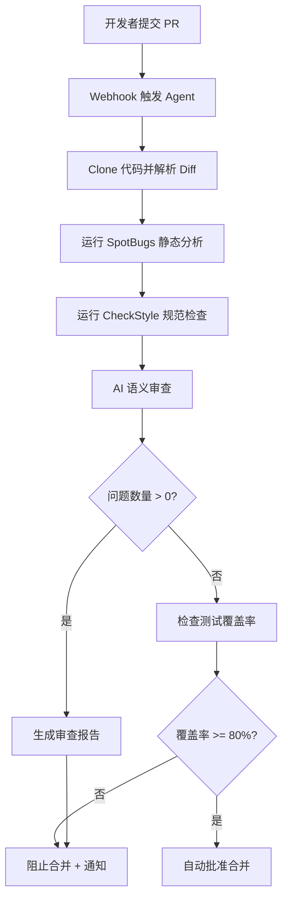

# Vibe Coding 系列 10：自定义 Agent 自动化 Java 特定任务

在前面几篇里，我们聊了 Cursor 的基础操作、Composer、Rules、工作区记忆。这些工具已经能覆盖日常开发的大部分场景。但说实话，如果每天都在做重复性工作——比如代码审查、生成单元测试、翻译文档——手敲这些指令也挺累的。

这时候就该让 Agent 登场了。

Cursor 的 Agent 不只是一个会聊天的 AI，它是真正可以被配置、被复用、被嵌入到工作流里的自动化单元。配置好之后，点一下按钮，整套流程就跑完了，不需要你盯着。

## 为什么需要自定义 Agent

Cursor 的通用 Agent 很强，但它的 prompt 是为"什么都做一点"设计的。碰到 Java 项目里的特定场景——比如要你每次 commit 前都跑一遍完整的代码审查，或者要求测试覆盖率必须达到 80% 才能通过——通用 Agent 就有点力不从心。它不知道你团队的规范，不知道你们的代码风格，更不知道哪些是老代码哪些是新写的。

自定义 Agent 的核心价值就在这里：你可以把团队规则、代码规范、流程约束全部编码进去，变成一个只属于你们团队的工具。

## Agent 配置完整示例

Cursor 支持通过 `.cursor/rules` 目录来定义 Agent 的行为规则。来看一个真实的配置例子：

```yaml
# .cursor/rules/java-review-agent.yaml
name: Java Code Review Agent
version: "1.0"
description: 团队专用 Java 代码审查 Agent，自动检查规范、安全和性能问题

instructions:
  - 审查范围：
    - Java 17+ 代码
    - Spring Boot 3.x 项目
    - 所有 PR 和 commit
    
  - 审查维度：
    - 代码规范：命名、注释、复杂度
    - 安全问题：SQL 注入、XSS、敏感信息泄露
    - 性能问题：N+1 查询、循环内数据库操作、大对象拷贝
    - 测试覆盖：新增代码必须有对应测试

  - 审查流程：
    1. 解析 diff，识别新增和修改的代码
    2. 运行静态分析工具（SpotBugs、CheckStyle）
    3. 结合 AI 进行语义审查
    4. 输出结构化审查报告

  - 输出格式：
    ```json
    {
      "files_reviewed": ["UserService.java", "OrderController.java"],
      "issues": [
        {
          "severity": "HIGH",
          "file": "UserService.java",
          "line": 42,
          "type": "SECURITY",
          "description": "直接拼接 SQL 参数，存在注入风险",
          "suggestion": "使用 PreparedStatement 或 JPA Criteria API"
        }
      ],
      "coverage": "78%",
      "passed": false,
      "summary": "发现 3 个高危问题，必须修复后才能合并"
    }
    ```

  - 拦截规则（任何一条触发则阻止合并）：
    - coverage < 80%
    - 存在 HIGH/CRITICAL 安全问题
    - 存在未处理的 N+1 查询
    
  - 注意事项：
    - 不要审查 vendor/ 目录下的第三方代码
    - 忽略generated/ 目录下的自动生成代码
    - 测试代码使用 @Nested 和 AssertJ 而不是旧式 JUnit 3 风格
```

这个配置文件定义了审查的范围、维度、流程、输出格式和拦截规则。把这个文件放到项目根目录，Cursor 的 Agent 就会在审查任务中遵循这些约束。

## Java 代码审查 Prompt 示例

有了配置基础之后，具体怎么写 prompt 也很重要。prompt 决定了 Agent 的注意力分配。下面是一个针对 Spring Boot 项目的代码审查 prompt：

```
请对以下 Java 代码进行深度审查，重点关注：

1. Spring Boot 规范
   - @Service/@Repository/@Component 注解使用是否正确
   - 依赖注入是否使用了构造器注入（避免 @Autowired 字段注入）
   - @Transactional 的使用是否正确（public 方法、自我调用问题）
   - 异常处理是否统一（@ControllerAdvice 全局异常处理）

2. 并发安全
   - 共享可变状态：类的成员变量是否可变
   - Collection 类：ArrayList/HashMap 在多线程环境的使用
   - Spring Bean 的作用域：@Scope("prototype") 的行为

3. 数据库操作
   - N+1 查询问题：使用 @EntityGraph 或 @Query 优化
   - 事务边界：读写分离、主从延迟
   - 批量操作：batch insert 的使用

4. API 设计
   - HTTP 状态码使用是否规范
   - 请求参数校验：@Valid/@Validated 的配置
   - 响应统一封装：ResultBean<T> 的使用

请逐文件分析，输出问题列表，按 severity 分级（BLOCKER/HIGH/MEDIUM/LOW）。
```

这个 prompt 把审查维度明确列出来，Agent 就会按图索骥，不会漏掉关键点。

## 自定义 Agent 代码实现

有时候你需要的不只是 prompt，而是能真正执行操作的 Agent。Cursor 支持通过 MCP（Model Context Protocol）协议接入自定义工具。来看一个实际的例子——创建一个自动生成单元测试的 Agent：

```java
// src/test/java/com/example/agent/TestGenerationAgent.java
package com.example.agent;

import org.springframework.ai.tool.annotation.Tool;
import org.springframework.ai.tool.annotation.ToolParam;
import org.springframework.stereotype.Component;

import java.io.IOException;
import java.nio.file.*;
import java.util.*;
import java.util.regex.*;

@Component
public class TestGenerationAgent {

    private static final Set<String> EXCLUDED_CLASSES = Set.of(
        "Application.class",
        "*Application*.java"
    );

    @Tool(name = "find_testable_classes", 
          description = "扫描 src/main/java 目录，识别需要测试的生产代码")
    public List<String> findTestableClasses(
        @ToolParam(description = "项目根目录路径") String projectRoot
    ) throws IOException {
        Path sourceRoot = Paths.get(projectRoot, "src/main/java");
        List<String> result = new ArrayList<>();
        
        Files.walk(sourceRoot)
            .filter(p -> p.toString().endsWith(".java"))
            .filter(p -> !p.toString().contains("/test/"))
            .filter(p -> !isExcluded(p.toString()))
            .forEach(p -> result.add(relativePath(sourceRoot, p)));
        
        return result;
    }

    @Tool(name = "generate_unit_tests",
          description = "为指定类生成 JUnit 5 + Mockito 单元测试")
    public String generateUnitTests(
        @ToolParam(description = "生产代码类名") String className,
        @ToolParam(description = "类内容") String sourceCode,
        @ToolParam(description = "测试框架偏好") String framework
    ) {
        // 解析类结构：方法签名、参数类型、返回类型
        List<MethodSignature> methods = parseMethods(sourceCode);
        
        StringBuilder testCode = new StringBuilder();
        testCode.append("package com.example.test;\n\n");
        testCode.append("import org.junit.jupiter.api.BeforeEach;\n");
        testCode.append("import org.junit.jupiter.api.Test;\n");
        testCode.append("import static org.junit.jupiter.api.Assertions.*;\n");
        testCode.append("import static org.mockito.Mockito.*;\n\n");
        
        testCode.append("@ExtendWith(MockitoExtension.class)\n");
        testCode.append("class ").append(toTestName(className)).("Test {\n\n");
        
        // 为每个 public 方法生成测试
        for (MethodSignature method : methods) {
            if (method.isPublic() && !method.isConstructor()) {
                testCode.append(generateTestMethod(className, method));
            }
        }
        
        testCode.append("}\n");
        return testCode.toString();
    }

    @Tool(name = "check_coverage",
          description = "运行 JaCoCo 覆盖率检查")
    public CoverageResult checkCoverage(
        @ToolParam(description = "项目根目录") String projectRoot,
        @ToolParam(description = "覆盖率阈值") int minCoveragePercent
    ) {
        // 调用 Maven/Gradle 执行 jacoco:test
        // 解析 target/site/jacoco/index.html
        // 返回覆盖率数据
        return CoverageResult.builder()
            .lineCoverage(78)
            .branchCoverage(65)
            .passed(minCoveragePercent <= 78)
            .build();
    }

    private List<MethodSignature> parseMethods(String sourceCode) {
        List<MethodSignature> methods = new ArrayList<>();
        Pattern pattern = Pattern.compile(
            "(public|protected|private)\\s+(\\w+)\\s+(\\w+)\\s*\\((.*?)\\)"
        );
        Matcher matcher = pattern.matcher(sourceCode);
        
        while (matcher.find()) {
            methods.add(new MethodSignature(
                matcher.group(1),
                matcher.group(2),  // return type
                matcher.group(3),  // method name
                matcher.group(4)  // parameters
            ));
        }
        return methods;
    }

    private boolean isExcluded(String path) {
        return EXCLUDED_CLASSES.stream()
            .anyMatch(path::contains);
    }

    private String relativePath(Path root, Path full) {
        return root.relativize(full).toString().replace("\\", "/");
    }

    private String toTestName(String className) {
        return className
            .replace(".java", "")
            .split("\\.")[^1];
    }

    private String generateTestMethod(String className, MethodSignature method) {
        return String.format("""

    @Test
    void should_%s_return_expected_result() {
        // Given
        // TODO: setup mock and input
        
        // When
        // TODO: call method under test
        
        // Then
        // assertThat(result).isNotNull();
    }
""", method.getName());
    }

    record MethodSignature(
        String visibility,
        String returnType,
        String name,
        String parameters
    ) {
        boolean isPublic() { return "public".equals(visibility); }
        boolean isConstructor() { return name.equals(name.toLowerCase()); }
    }
}
```

这个 Agent 有三个核心工具：`find_testable_classes` 扫描可测试的类，`generate_unit_tests` 根据类结构生成测试代码，`check_coverage` 运行覆盖率检查。把它接入 Cursor 的 MCP 之后，你就可以用自然语言驱动整个测试生成流程。

## 接入 Cursor Agent

把上面的 Java Agent 接入 Cursor 需要在 `.cursor/mcp.json` 里注册：

```json
{
  "mcpServers": {
    "java-test-agent": {
      "command": "java",
      "args": [
        "-jar",
        "/path/to/test-agent.jar",
        "--port", "8080"
      ],
      "env": {
        "JAVA_HOME": "/usr/local/openjdk17"
      }
    }
  }
}
```

注册完成后，在 Cursor 的 Agent 面板里就能看到这个工具了。输入"为 UserService 生成测试并检查覆盖率"，Agent 会自动调用 `find_testable_classes` → `generate_unit_tests` → `check_coverage` 的完整链路。

## 自动代码审查工作流

有了自定义 Agent，代码审查就不再是"人肉看代码"了。来看一个完整的自动化工作流：



这套流程完全不需要人工介入。Agent 发现问题就阻止合并并发通知，没问题就自动批准。整个审查周期从几小时压缩到几分钟。


## 自定义 Agent 的维护

Agent 配置和代码写好之后，维护是个现实问题。团队成员会提需求："能不能加一个检查""能不能换个标准"，配置文件越积越多，最后没人知道哪个规则对应哪个场景。

我的经验是：把 Agent 配置当作代码来管理。每个规则文件配上对应的测试，用真实的 PR 来验证规则是否生效。同时，半年做一次全面 review，删除过时规则，更新老旧标准。Agent 越用越聪明，但也需要定期"修剪"。

## 结语

Cursor 的自定义 Agent 把 AI 编程从"每次都要说一遍要求"提升到"配置一次，永久复用"。对于有明确流程规范的团队来说，这个价值是巨大的。代码审查、测试生成、文档翻译，这些重复性工作都可以交给 Agent，你只需要专注真正需要创造力的部分。

下篇我们来聊点不一样的：怎么用 Cursor 做全栈开发，把 Spring Boot 后端和 React 前端串起来。
